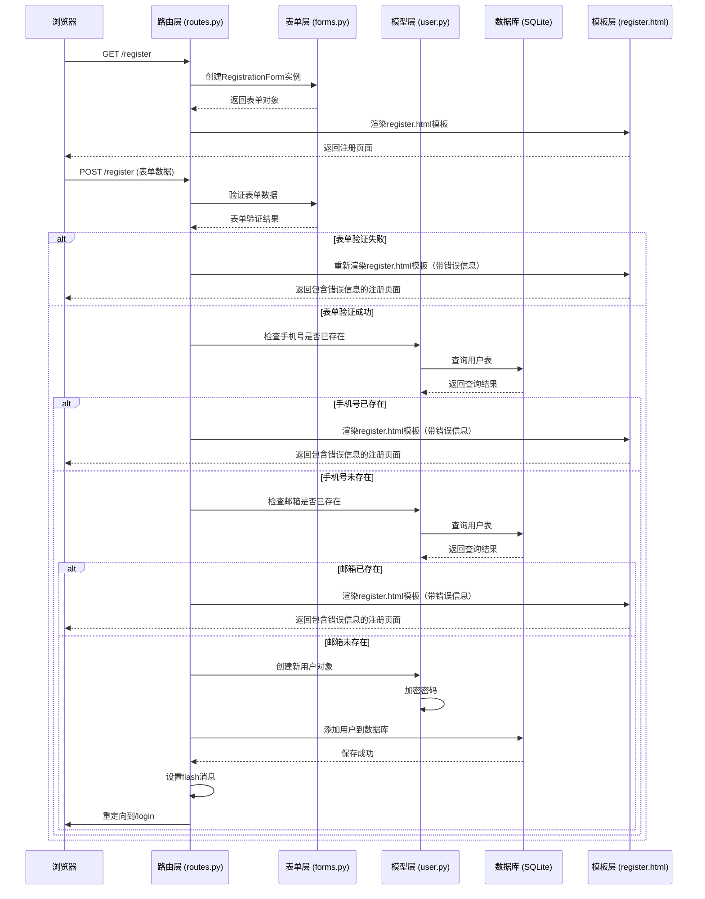
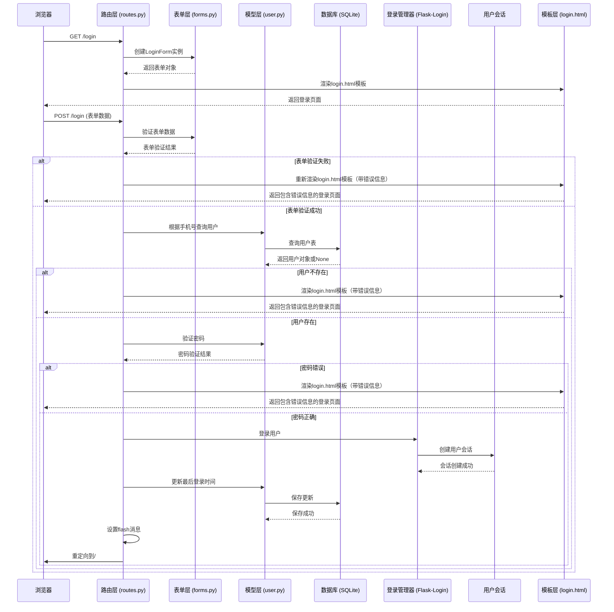
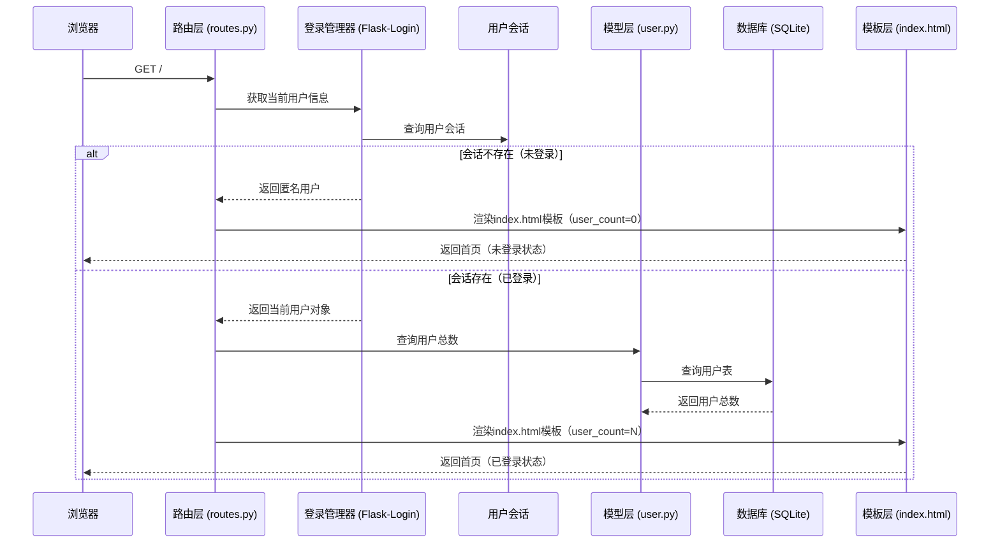
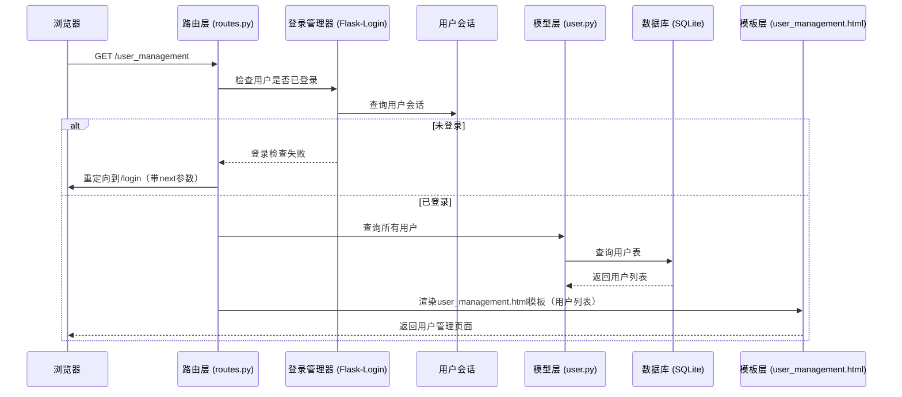
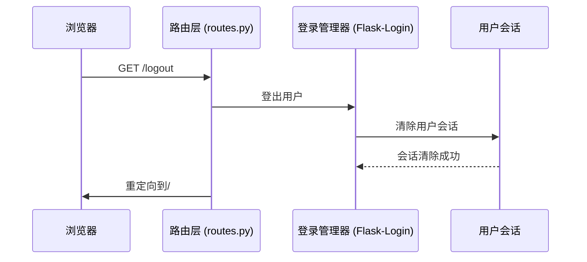
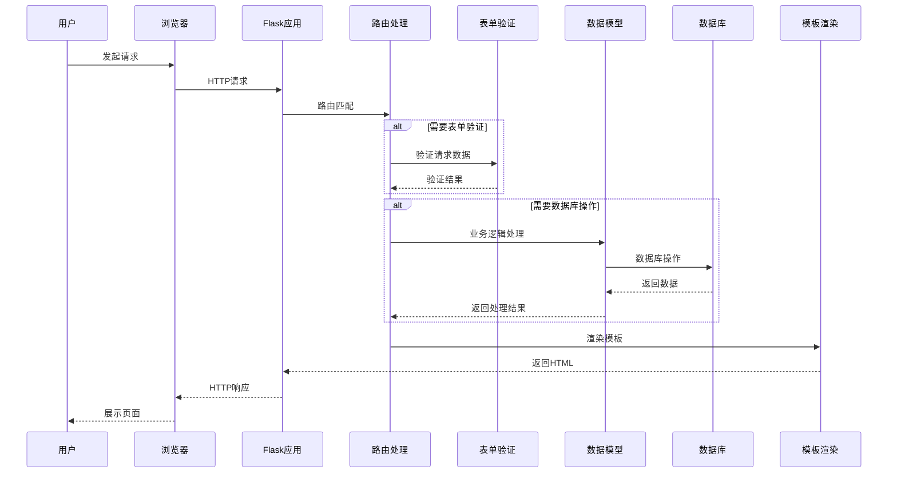
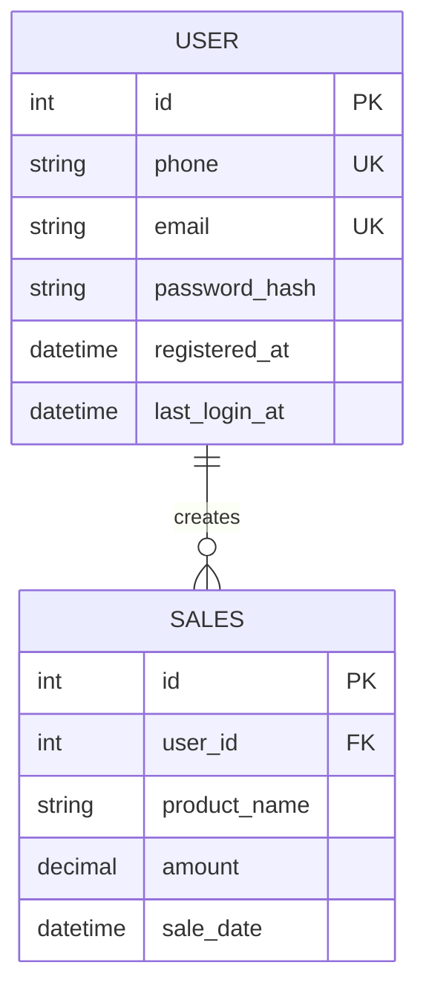
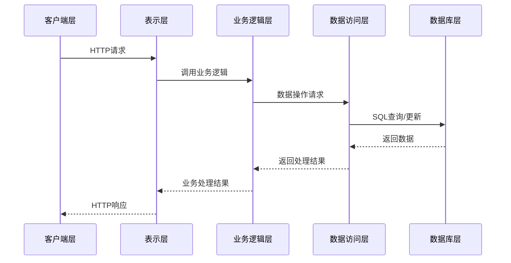

# 销售管理系统功能调用链路

## 概述

本文档使用Mermaid序列图详细描述销售管理系统主要功能的调用链路，包括用户注册、登录、用户管理和退出登录等核心功能的执行流程。

## 1. 用户注册功能调用链路

## 2. 用户登录功能调用链路

## 3. 首页访问功能调用链路

## 4. 用户管理页面访问功能调用链路

## 5. 退出登录功能调用链路

## 6. 核心组件交互关系

## 7. 数据模型关系

## 8. 系统架构分层

## 总结

本项目采用典型的MVC（Model-View-Controller）架构模式：

- **Model（模型层）**: 负责数据的存储和业务逻辑处理，对应`app/models/`目录
- **View（视图层）**: 负责数据的展示，对应`app/templates/`目录
- **Controller（控制层）**: 负责请求的处理和业务逻辑的调度，对应`app/routes.py`文件

通过清晰的分层架构和明确的调用链路，系统实现了高内聚、低耦合的设计目标，便于维护和扩展。

---

**最后更新**: 2026-03-23
